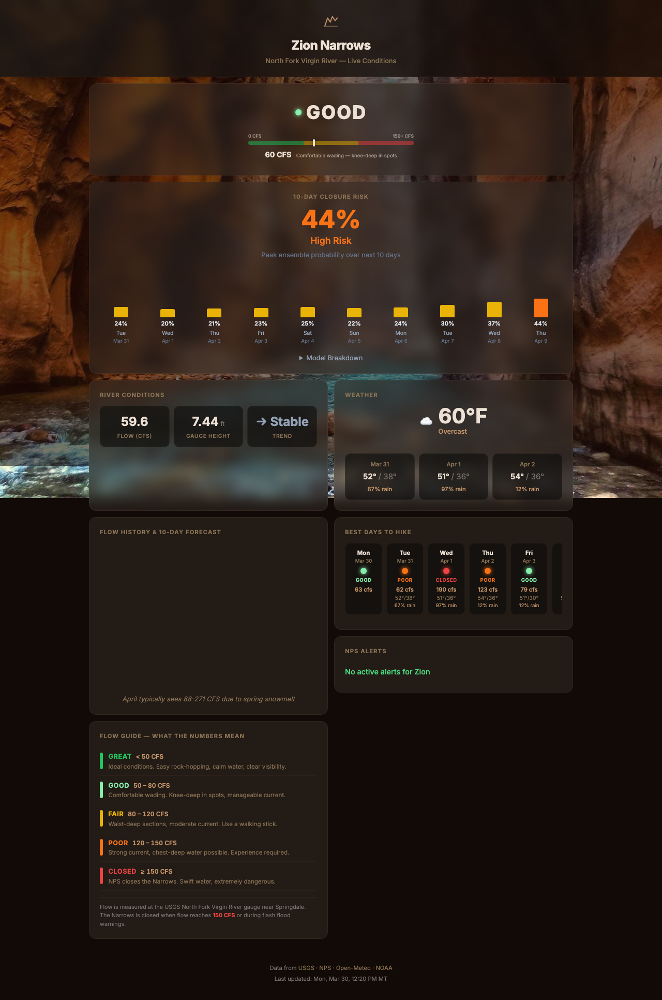

# Zion Narrows Status Tracker

A mobile-friendly dashboard that tracks whether the Narrows hike in Zion National Park is open, based on real-time river flow, weather, and NPS alerts. Updated twice daily.

**[View the live dashboard](https://nefario7.github.io/zion-narrows-tracker/)**

## How to Read the Dashboard

### Status Indicator

The top of the dashboard shows the current hiking status:

| Status | Meaning |
|--------|---------|
| **Open** | River flow is low — easy hiking conditions |
| **Caution** | Moderate flow — expect stronger currents |
| **Dangerous** | High flow — difficult and dangerous conditions |
| **Closed** | River flow too high or NPS closure in effect |

Status is based on the North Fork Virgin River flow rate in cubic feet per second (CFS) at the USGS gauge near Springdale, UT. An official NPS closure alert will override the flow-based status.

### Flow Chart

The chart shows recent river flow readings so you can see whether conditions are trending up or down.

### Weather

Current conditions and a 3-day forecast for the Zion area, so you can plan around rain (which raises river levels).

### NPS Alerts

Any active park alerts related to the Narrows — closures, hazard warnings, or other notices from the National Park Service.

## Data Sources

- [USGS](https://waterdata.usgs.gov/monitoring-location/09405500/) — River flow and gauge height
- [NPS](https://www.nps.gov/zion/) — Official park alerts
- [Open-Meteo](https://open-meteo.com/) — Weather data
